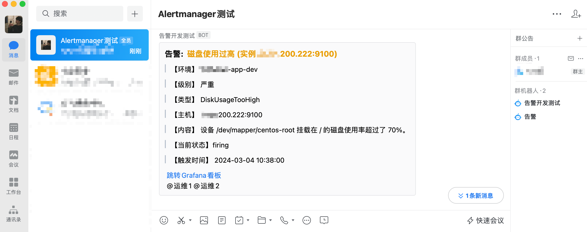

🍭 alertmanager 告警微信机器人 webhook

---

构建：

```sh
env GOOS=linux GOARCH=amd64 go build  -o ./bin/webhook  
```

参数：

+ -RobotKey ： 微信机器人webhook url key
+ -addr：监听地址，默认值（:3000）

运行方式：

1. 二进制 + systemd
2. docker


告警模版：修改文件 `transformer/transformer.go`

 

